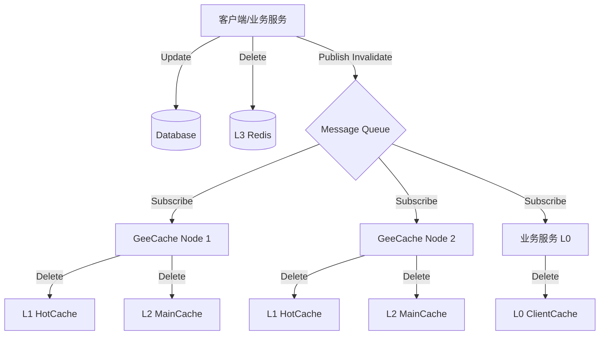

# 多级缓存一致性 (Multi-Level Cache Consistency)

在引入多级缓存（L0 客户端缓存、L1 本地热点缓存、L2 分布式节点缓存、L3 集中式缓存）后，数据一致性成为一个核心挑战。

## 问题描述
当底层数据源（DB）发生变化时，如何确保所有层级的缓存都能及时更新或失效？
如果只更新了 DB，而缓存中仍然是旧数据，就会导致脏读。

## 解决方案：消息队列/发布订阅 (Pub/Sub)

通常采用 **主动失效** + **消息广播** 的机制。

### 架构设计
1. **更新路径**：
   - 客户端请求更新数据。
   - 应用服务更新 DB。
   - 应用服务更新/删除 L3 (Redis)。
   - 应用服务向消息队列（如 Kafka, RabbitMQ, Redis Pub/Sub）发送 "Invalidate Key" 消息。

2. **广播与处理**：
   - 所有 GeeCache 节点订阅该消息队列。
   - 当收到 "Invalidate Key" 消息时：
     - **清除 L1 (HotCache)**：当前节点如果缓存了该热点 key，立即删除。
     - **清除 L2 (MainCache)**：如果当前节点是该 key 的 Consistent Hash 拥有者，立即删除。
   - 客户端服务（如果有 L0）也订阅该消息队列：
     - **清除 L0 (ClientCache)**：立即删除本地内存中的 key。

### 流程图

## 延迟双删 (Delayed Double Delete)
为了防止在更新 DB 和删除缓存之间发生并发读写导致脏数据再次写入缓存，可以使用延迟双删策略：
1. 删除缓存。
2. 更新 DB。
3. 休眠 N 毫秒。
4. 再次删除缓存。

## GeeCache 中的实现建议
在 `GeeCache` 中，可以通过集成 Redis Pub/Sub 来实现简单的广播机制。
- 新增 `Watcher` 接口，用于监听失效事件。
- 在 `Group` 中启动一个 goroutine 监听 Redis Channel。
- 收到消息后调用 `g.RemoveLocal(key)`。
